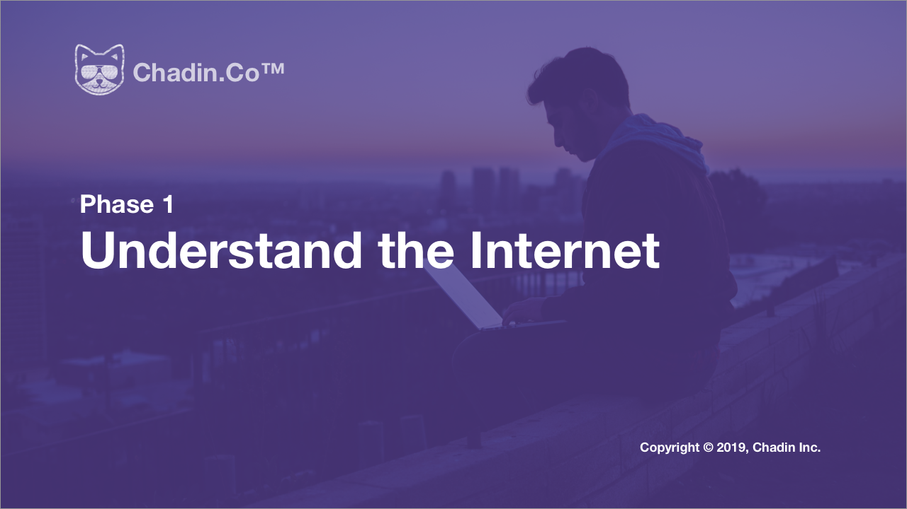
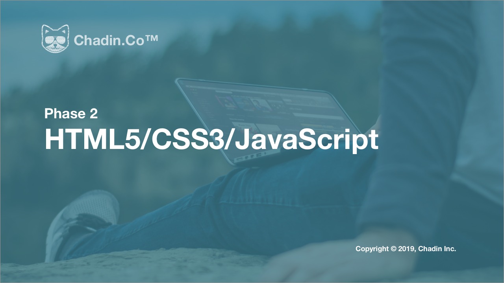

# Chadin Web Development Core

Chadin, as an internet company, encourages every division within the organization (design, marketing, legal, etc.) to understand the development of its core product and services. The Web Development Core is a progression of internal curriculums that everyone may follow at their own pace to acquire skills for building an app or web service just like Chadin.

## Materials

While most of the knowledge in the whole series is technical, we try to provide sufficient amount of examples, analogies and exercises to make the journey more approachable. We'll also reference many external resources to supplement the materials. If you're diligent and follow along the course objectives, you'll by the end have the essential skills to build an internet-based service, and even start a tech company of your own around it.

## Main Progression

This directory describe the structure of the entire curriculum, including separate links to specific sub-progressions.

<!-- ### Before We Begin

There's a separate progression on [Algorithms and Data Structures](). This is the fundamental knowledge that any CS majors would learn in universities. These are skills (and conceptual understandings) that underlie all your development effort and help you develop programmatic problem-solving skills. -->

### Phase 1: Understand The Internet

The Internet may seem like a huge collection of structureless information for many people. The great abundance of site varieties and their interactions makes it difficult to grasp the origin and evolution of its nature.

Start by watching [How to Understand The Internet](https://vimeo.com/325983199) to gain an understanding of the conceptual framework we'll use throughout the course. Then, using the Island Analogy introduced, we'll [Consider an Internet-based Solution for a Business Objective](https://vimeo.com/325983522). Equipped with the Island Analogy, it'll be much easier to understand the complex interactions and coordination of web services later in the curriculum. For now, keep the example on the back of your mind and your understanding of the internet will develop as you progress through the rest of the curriculum.

### Phase 2: Starting Front-end Development. HTML5/CSS3/JavaScript

The first real step in product development is to gain proficiency in developing attractive interfaces. This is usually not the heavy focus of traditional CS programs, but occupies an important area in real-life product development. Good interface provides a comfortable and relatable experience for users and also indicates the company has dedicated resources for improving the product.

Detailed sub-progression for this phase is in [HTML5-CSS3-JavaScript](https://github.com/chadin-engineering/HTML5-CSS3-JavaScript).

<!-- ### Phase 3: Starting Back-end Development with NodeJS

### Phase 4: SQL and Introduction to Databases

### Phase 5: Production Back-end Development (Part 1, RESTful)

### Phase 6: Production Back-end Development (Part 2, Authentication)

### Phase 6: Deploying Your Application

### Phase 7: Advanced Front-end Development with ReactJS

### Phase 8: Build a Full-stack Web Application

### Phase 9: Build a Mobile Application with ReactNative

### Phase 10: Beyond This Point

## Selective Topics

### T12. Unit Testing for Your Code
### T55. Essential Higher Mathematics
### T56. Essential Statistics
### T61. Descriptive Statistics with Python
### T62. Basic Data Science with Python
### T67. Program for Optimization
### T79. Blockchain
### T84. Basic Artificial Intelligence with Neural Networks
### T85. Specialized Neural Networks -->
